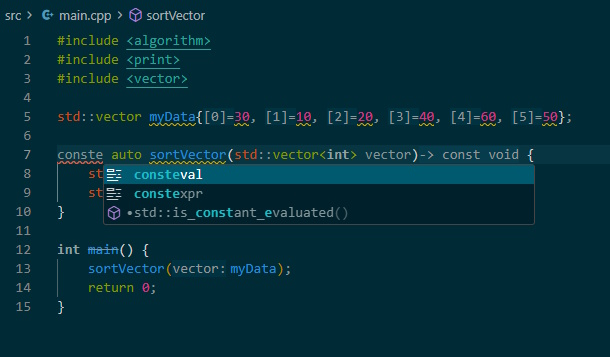

# Flow++

A lightweight inline completion engine for C and C++ in VSCode and Cursor.

`Flow++` provides fast local inline completions while you type.



In this example, consteval and constexpr are suggested by Flow++ and identified by this icon.

## Features

### Modern C++ Coverage

Flow++ includes completion support for:

- Algorithms
- Atomics
- Chrono
- Concepts
- Containers
- Contracts
- Execution
- Expected
- Filesystem
- Format
- Memory Utilities
- Optional
- Ranges
- Range Views
- Stop Tokens
- Threads
- Type Traits
- Variant
- Standard Library Headers
- C and C++ Keywords
- Preprocessor Directives

### Inline Completions

- Fast local inline suggestions
- No AI services required
- No internet connection required
- Works alongside clangd
- Low-overhead completion generation

### Language Support

- C (C90 through C23)
- C++ (C++11 through C++26)

### Convenience Features

- Debounced suggestions to reduce flickering
- Automatic language detection
- Correct handling of `.c`,`.cpp`,`.h` and `.hpp` files
- Toggle via status bar
- Toggle via command palette
- Configurable extension settings

---

## Requirements

- VS Code
- Cursor
- Node.js 18.x or later (for building from source)
- vsce (for packaging)

---

## Building from Source

Clone the repo and install the npm dependencies in the following order:

```bash
npm install
npm run compile
```

Package the extension:

```bash
vsce package
```

Install into Cursor:

```bash
cursor --install-extension flowplusplus-2.0.0.vsix
```

Or install into VS Code:

```bash
code --install-extension flowplusplus-2.0.0.vsix
```

## License

This project is licensed under the MIT License - see the [LICENSE](LICENSE) file for details.